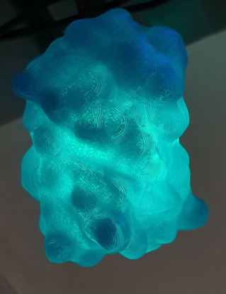
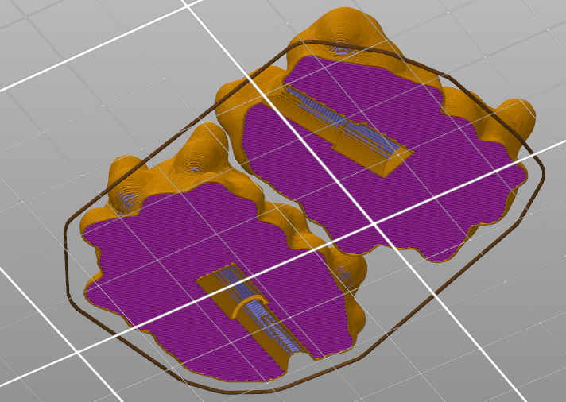

# mTurquoise2 holiday lights

Print these two STL files with transparent filament and/or thin walls and super glue around small LED holiday lights (or modify the STL files for lights of any size). The tubes to hold the lights are about 6 mm x 9 mm where the light goes and 5 mm x 15 mm where the stem holding the light goes.

Printed with no supports on Prusa mk3s, 5% infill, single perimeter with a few small holes and errors.

Based on mTurquoise2 PDB file 3ZTF published in Goedhart et al, Nat Comms 3, 2012 [DOI 10.1038/ncomms1738](https://doi.org/10.1038/ncomms1738).

