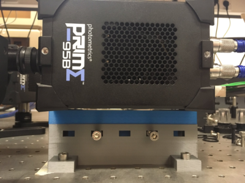
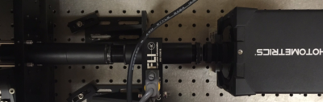
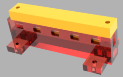
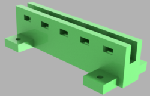
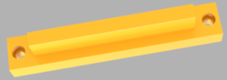

# 1D linear stage for Photometrics Prime95B

Designed by Joana Valério (Instituto Superior Técnico, Biological Engineering) and Zach Hensel (ITQB NOVA). Released under the MIT License.

## Description

This is a 1D linear stage to align the center of a Photometrics Prime95b camera with the optical axis of the Mad City Labs RM21 microscope body.

The STL files can be modified and the stage placed on a kinematic stage for tilt and displacement along other axes. Or the base design can be modified to achieve different sensor heights.

Requirements: 
  * Optical axis aligned with holes on optical table with M6 holes spaced 25 mm
  * Image centered 112.5 mm above table
  * Photometrics Prime95b camera or camera with identical spacing between mounting screws and distance between mounting screws and image center (e.g. Photometrics Prime BSI)
  * 2x 0.5-inch 1/4x20 machine screws
  * 4 M6x16mm cap screws
  * Addition M6x16mm cap screws and nuts to fix linear position

## Print settings

* Prusa mk3s
* Prusa standard 1.75 mm PLA filament
* Slic3r PE edition (2.0.0) 0.2 mm Quality preset

## Notes

* Tolerance for sliding part is only 0.05 mm. Parts can be lubricated with silicone grease and it may be necessary to modify the STL files to add addition tolerance for your printer
* A new version pictured below has been designed but not tested yet; a ruler was added to the help keep track of stage positions and some small modifications were made to get smoother stage movement. If it is printed and works well, we will add the STL files for it.

